# Receiver data taken for LBASS 
## (10 - 13th of Sept 2018)

### The summary of all the results obtained from the tests on the corelation receiver have been briefed here. 

### Different configurations tested were:
<a href="#ref1"> 1.</a> Receiver with a _single_ hybrid (1 magic-tee)

<a href="#ref2">2.</a> Receiver with _two_ hybrids (1 magic tee, 1 stripline hybrid)

<a href="#ref3">3.</a> Receiver with a **Phase switch** and a _single_ hybrid (1 magic-tee)

<a href="#ref4">4.</a> Receiver with a **Phase switch** and _two_ hybrids (1 magic-tee, 1 stripline hybrid)

### Data taken on cross-talk 
The cross-talk between the two signals of the receiver was minimized by correcting for the phase in the system. This was executed by trying multiple length cables. The data obtained has been summarized <a href="#ref5">below</a>.

## 
1. Receiver with _single_ hybrid

Two tests were attempted for the given configuration. The first test was taken for aprroximately 30 mins while the second test lasted for only 15 mins. 

## 
Test 1

<a name="ref1">
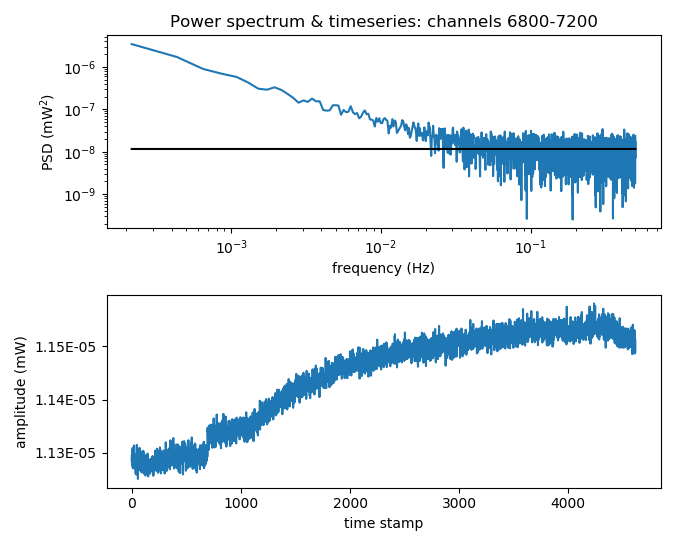 
 	
<figcaption align="left">Fig 1a. signal 1</figcaption>
 
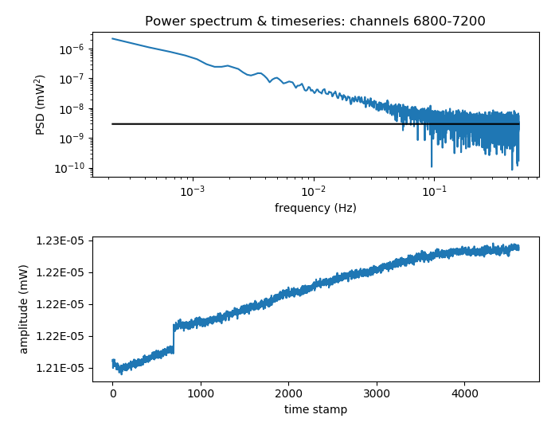
<figcaption align="left">Fig 1b. signal 2</figcaption>

## 
Test 2

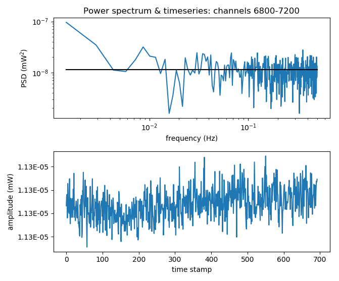 
 	
<figcaption align="left">Fig 2a. signal 1</figcaption>
 
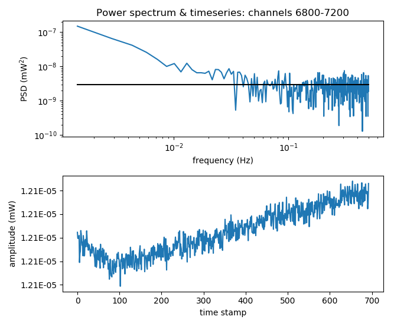
<figcaption align="left">Fig 2b. signal 2</figcaption>
</a>

## 
2. Receiver with _two_ hybrids 

Two tests were attempted for the given configuration. Each test lasted for approx. 15 mins. Test 1 showed a step in the timeseries and was hence rejected.

## 
Test 1

<a name="ref2">
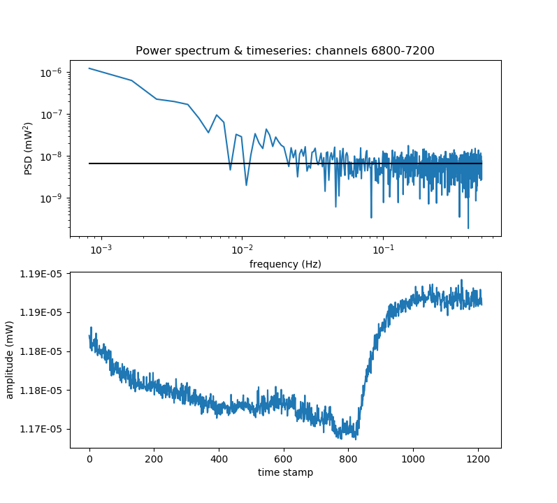 
 	
<figcaption align="left">Fig 3a. signal 1</figcaption>
 
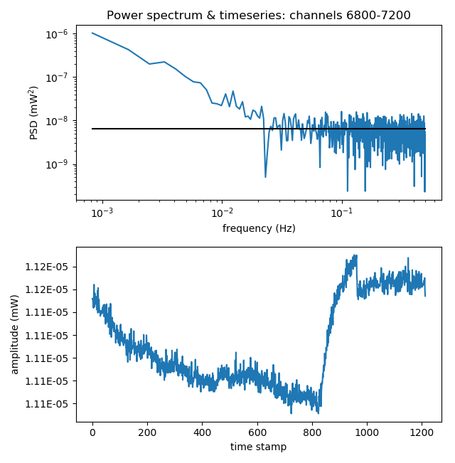
<figcaption align="left">Fig 3b. signal 2</figcaption>

## 
Test 2

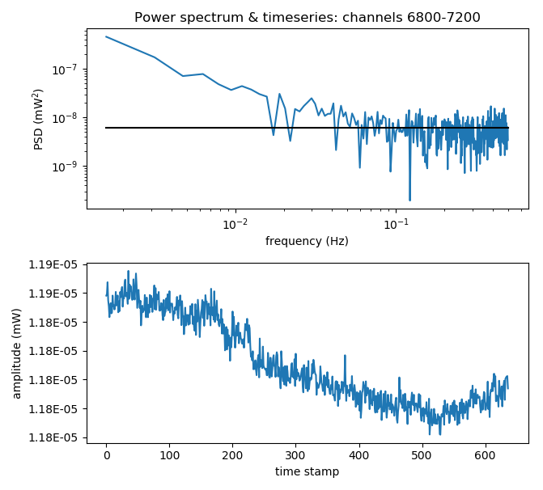 
 	
<figcaption align="left">Fig 4a. signal 1</figcaption>
 
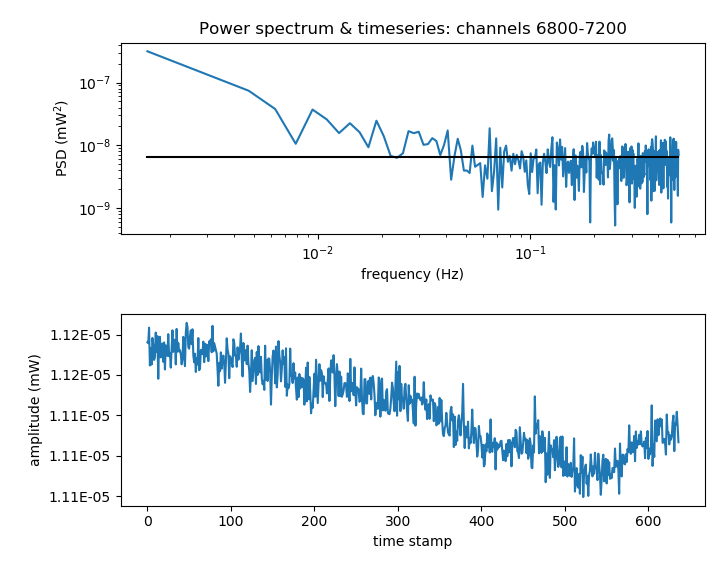
<figcaption align="left">Fig 4b. signal 2</figcaption>
</a>

## 
3. Receiver with **Phase switch** and _single_ hybrid 

Two tests were attempted for the given configuration. The following configuration did not involve the second stripline hybrid.

## 
Test 1

<a name="ref3">
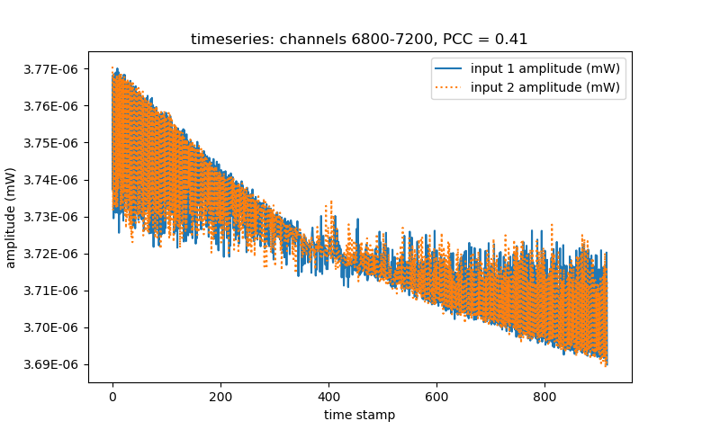 
 	
<figcaption align="left">Fig 5a. Time series for the two signals, signal 1 (blue) and signal 2 (orange) </figcaption>
 
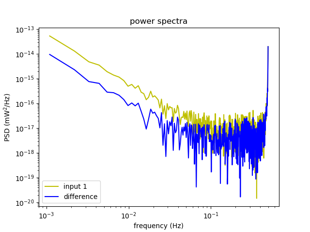 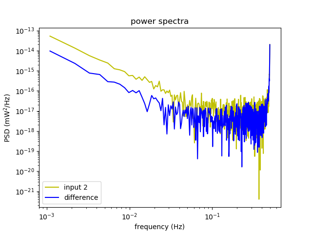

<figcaption align="left">Fig 5b. (i) Power spectrum for signal 1 (green) with difference (blue). (ii) Power spectrum for signal 2 (green) with difference (blue)</figcaption>
</a>

## 
4. Receiver with **Phase switch** and _two_ hybrids 

Two tests were attempted for the given configuration. The following configuration involved the second stripline hybrid.

## 
Test 1

<a name="ref4">
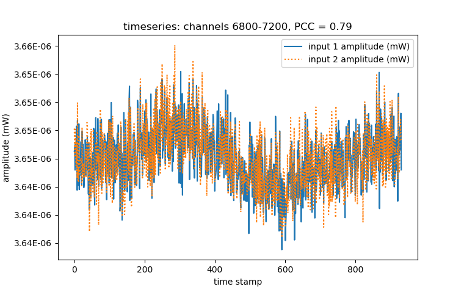 
 	
<figcaption align="left">Fig 6a. Time series for the two signals, signal 1 (blue) and signal 2 (orange) </figcaption>
 
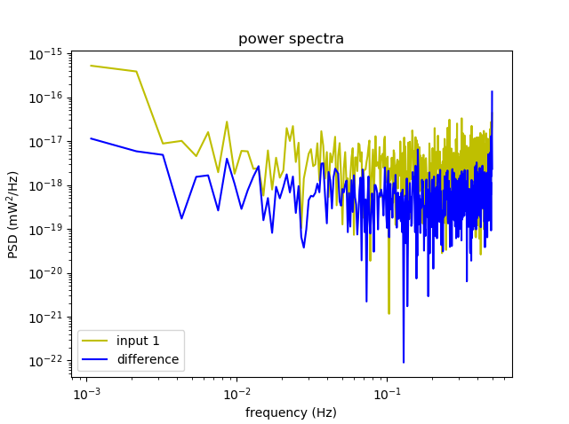 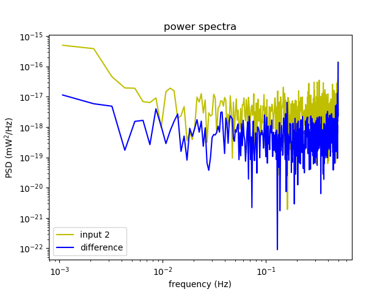

<figcaption align="left">Fig 6b. (i) Power spectrum for signal 1 (green) with difference (blue). (ii) Power spectrum for signal 2 (green) with difference (blue)</figcaption>

## 
Test 2

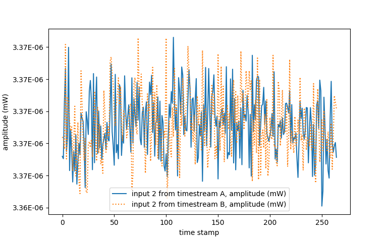 
 	
<figcaption align="left">Fig 7a. Time series for the two signals, signal 1 (blue) and signal 2 (orange) </figcaption>
 
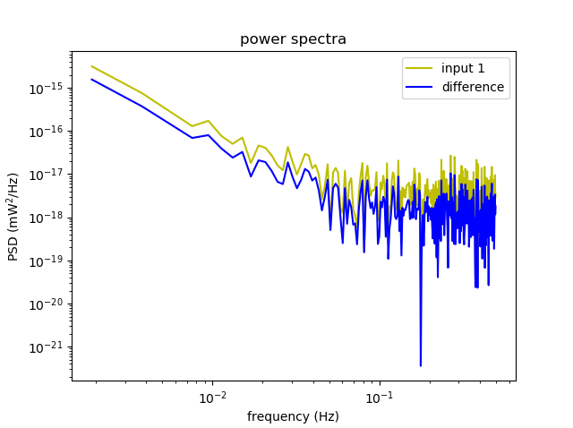 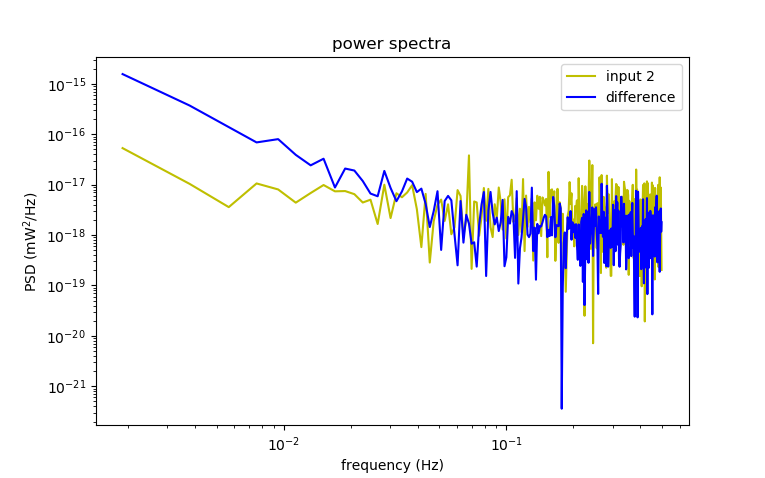

<figcaption align="left">Fig 7b. (i) Power spectrum for signal 1 (green) with difference (blue). (ii) Power spectrum for signal 2 (green) with difference (blue)</figcaption>
</a>

<table style="width:40%" align="center">

<tr>
    <th bgcolor="#D4D3C8">Degree of cross-talk (dB)*</th>
    <th bgcolor="#D4D3C8">Length of the cable (cm)</th> 
</tr>

<tr align="center">                                          
    <td>-14</td>
    <td>22</td>
</tr>
  
<tr align="center">
    <td>-5</td>
    <td>9</td>
 </tr>

<tr align="center">
    <td>-4.5</td>
    <td>32</td>
</tr>

<tr align="center">
    <td>-13.5</td>
    <td>29</td>
</tr>
  
 </table>

* Degree of cross-talk (dB) = [Power recorded with Noise diode on - Power record with noise diode off] 

 
<figcaption align="left">Fig 8. The data plotted with the best fitting sine curve. </figcaption>
